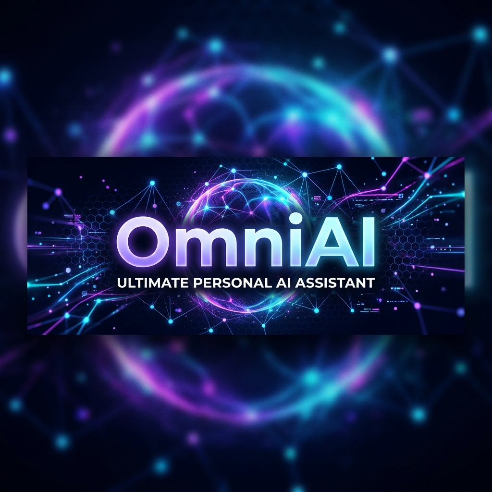

<p align="center">
  
</p>

<h1 align="center">OmniAI v2 – Ultimate Personal Assistant</h1>

<p align="center">
  A fully-featured personal assistant with RBAC, real AI, music upload, and smart home voice control.
</p>

<p align="center">
  
  
  
  
</p>

---

## 🚀 Quick Start

```bash
# 1. Install dependencies
npm install

# 2. Configure your API key
cp .env.example .env
# Edit .env and add: ANTHROPIC_API_KEY=sk-ant-...

# 3. Start everything (frontend + backend server together)
npm run dev
```

Visit http://localhost:3000

---

## 🔐 Demo Accounts (RBAC)

| Email | Password | Role | Access |
|-------|----------|------|--------|
| admin@omni.ai | admin123 | Admin | Full access + user management |
| sara@omni.ai | premium123 | Premium | All features including AI |
| mike@omni.ai | user123 | User | Core features, no AI |
| guest@omni.ai | guest123 | Guest | Dashboard + Entertainment only |

---

## 🤖 AI Assistant Fix

The AI was failing because browsers block direct Anthropic API calls (CORS).
The fix: a local Express proxy server (`server.js`) handles the API call server-side.

**How it works:**
```
Browser → /api/chat → server.js → Anthropic API
```

Run `npm run dev` to start both frontend and backend together.

---

## 🎵 Music Upload

In the Entertainment → Music tab, click **Upload Files** to upload any audio file (MP3, AAC, WAV, FLAC).
The file plays directly in the browser using the HTML5 Audio API.
Uploaded tracks show a ▶ button. External tracks link to Spotify and YouTube.

---

## 🏠 Smart Home

The app runs in **Demo Mode** by default (all controls are simulated).

**Real web APIs actually used:**
- Battery Status API (real battery level from your device)
- Web Speech API (voice commands — requires Chrome/Edge)
- Web Notifications API (device change alerts)

**To connect real devices:**
1. **Home Assistant**: Click ⚙ in Smart Home → enter your HA URL and access token
2. See the ℹ info panel for Google Home, SmartThings, Philips Hue setup guides

**Voice command examples:**
- "Turn on living room lights"
- "All lights off"
- "Set brightness to 80"
- "Set temperature to 22"

---

## 📁 Project Structure

```
omni-ai/
├── server.js              ← Express API proxy (run alongside Vite)
├── .env                   ← API keys (create from .env.example)
├── vite.config.js         ← Proxies /api/* to backend server
├── src/
│   ├── contexts/
│   │   └── AuthContext.jsx        ← RBAC with 4 roles
│   ├── components/
│   │   ├── auth/
│   │   │   └── LoginScreen.jsx    ← Login UI with demo accounts
│   │   ├── layout/
│   │   │   ├── Sidebar.jsx        ← Collapsible, role-aware
│   │   │   └── Topbar.jsx         ← User info + logout
│   │   └── ui/                    ← Badge, Button, Card, Modal, etc.
│   ├── hooks/
│   │   ├── useChat.js             ← AI chat (uses /api/chat proxy)
│   │   └── useLocalStorage.js
│   ├── data/
│   │   ├── tasks.js · health.js   ← Seed data
│   │   ├── courses.js · media.js
│   │   ├── devices.js
│   │   └── flashcards.js          ← Course-specific flashcards
│   ├── views/
│   │   ├── AIAssistant/           ← Voice input, copy, delete messages
│   │   ├── Learning/              ← Session timer, notes, editable flashcards
│   │   ├── Entertainment/         ← Music upload, real links, custom items
│   │   ├── SmartHome/             ← Voice control, Web APIs, HA integration
│   │   └── Settings/              ← RBAC panel, password, data export
│   └── styles/                    ← CSS design system
```

---

## 🔧 Tech Stack

- **React 18** + Vite
- **Express** (backend proxy for AI API)
- **Recharts** (charts)
- **Lucide React** (icons)
- **Anthropic Claude API** (AI assistant)
- **Web APIs**: Audio, Speech Recognition, Notifications, Battery
